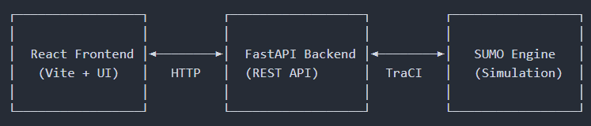
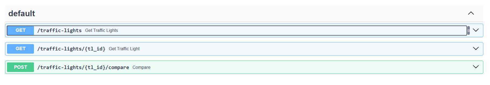
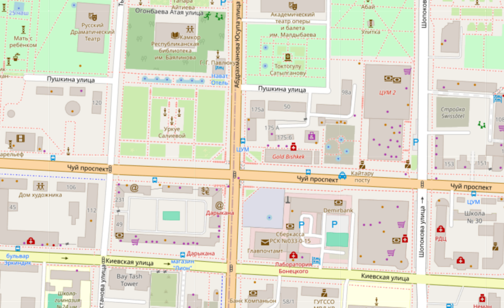
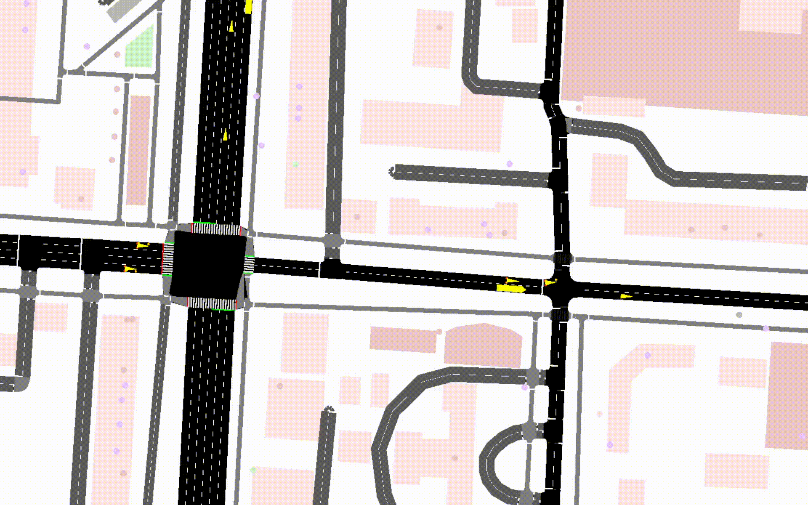
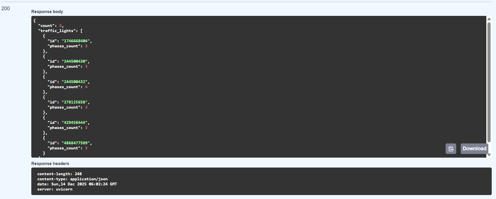
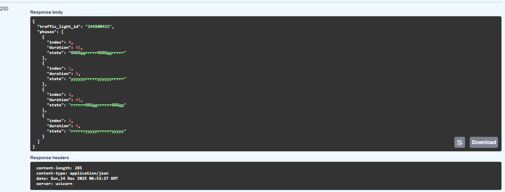
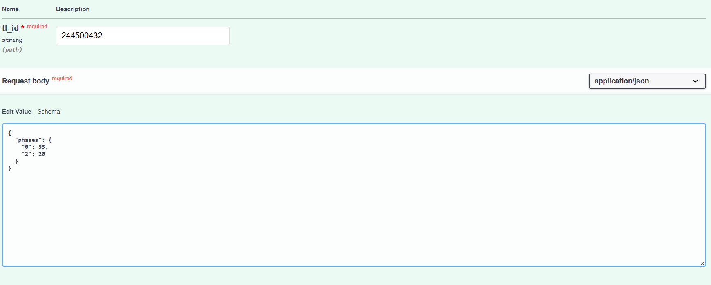
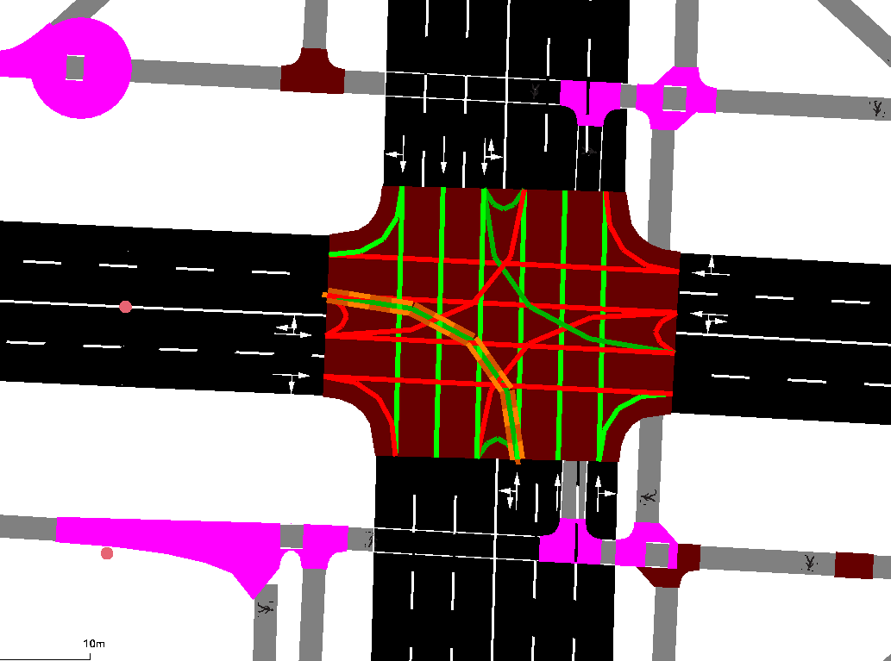

# 🚦 Smart Traffic Simulator for Bishkek

Платформа для тестирования и сравнения настроек светофоров  
на основе реальной микроскопической транспортной симуляции (SUMO)  
перед внедрением изменений в городе.

---

## Frontend


---

## 🌍 Реалистичность симуляции

Платформа использует SUMO —  
микроскопический транспортный симулятор,  
который моделирует поведение каждого автомобиля отдельно.

В симуляции учитываются:
- реальные ограничения дорожной сети
- взаимодействие транспортных средств
- правила проезда перекрёстков
- влияние светофоров на потоки движения

SUMO используется в академических исследованиях,  
Smart City проектах и при транспортном планировании,  
что делает полученные данные репрезентативными  
для предварительного анализа решений.

---

## 🏗️ Архитектура

<p align="center">
  
</p>

---

## API

<p align="center">
  
</p>

---

## Используя наш API, вы тестируете платформы на светофоре (Чуй/Юсупа Абдрахманова)

<p align="center">
  
</p>

---

## ▶ Simulation Playback

<p align="center">
  
</p>

Воспроизведение помогает понять *почему* конфигурация работает лучше.

---

## Получить айди всех светофоров с карты (/traffic-lights)

<p align="center">
  
</p>

---

## Получить фазы светофора по айди (/traffic-lights{tl_id})

<p align="center">
  
</p>

```
Фаза 0: Север-Юг (зеленый) — 41 сек
Фаза 1: Все желтые          —  4 сек
Фаза 2: Восток-Запад (зеленый) — 41 сек
Фаза 3: Все желтые          —  4 сек
```
---

## Сравнить с текущими фазами светофора свои настройки

<p align="center">
  
</p>

<p align="center">
  
</p>

---

## INFO - Светофор в SUMO

<p align="center">
  
</p>

---

## 🛠️ Конфигурация SUMO

### Файлы симуляции

**bishkek.sumocfg** — основной конфигурационный файл
```xml
<configuration>
    <input>
        <net-file value="bishkek.net.xml"/>
        <route-files value="bishkek.rou.xml"/>
    </input>
    <time>
        <begin value="0"/>
        <end value="3600"/>
    </time>
</configuration>
```

---
## 📊 Метрики и их расчёт

Для оценки эффективности работы светофоров  
платформа использует метрики,  
которые напрямую рассчитываются симулятором SUMO.

Мы не используем искусственные или визуальные показатели —  
все данные получаются из реального хода симуляции.

### 🚗 Средняя длина очереди

Средняя длина очереди рассчитывается как количество  
остановившихся транспортных средств на полосах движения  
на каждом шаге симуляции.

На каждом временном шаге:
- определяется число машин со скоростью ≈ 0
- значения суммируются
- затем усредняются по всему времени симуляции

Эта метрика напрямую отражает уровень загруженности перекрёстка  
и вероятность образования заторов.

### ⌛ Среднее время ожидания

Среднее время ожидания рассчитывается как суммарное время,  
которое транспортные средства проводят в ожидании  
перед проездом перекрёстка.

Метрика показывает:
- насколько долго автомобили вынуждены стоять
- насколько эффективно распределяется зелёный сигнал
- насколько комфортно движение для участников трафика

### ⏱ Временные ряды (Timeline)

Помимо усреднённых значений,  
платформа сохраняет временные ряды метрик:

- длина очереди на каждом шаге
- активная фаза светофора
- динамика ожидания во времени

Это позволяет:
- анализировать пиковые нагрузки
- находить проблемные фазы
- понимать причину улучшения или ухудшения показателей

---

## 📈 Как рассчитывается процент улучшения

Процентное изменение рассчитывается  
относительно текущей (базовой) конфигурации светофора.

Формула:

(custom − baseline) / baseline × 100%

- отрицательное значение — улучшение (очередь или ожидание уменьшились)
- положительное значение — ухудшение
- 0% — отсутствие значимых изменений

---

## 🚦 Базовые настройки светофоров

В качестве базовой конфигурации  
используются настройки светофоров,  
заданные в исходной дорожной модели.

Они включают:
- последовательность фаз
- длительность каждой фазы
- разрешённые направления движения

---

## ^^ Команда
Asel && Yana — Pitch / Design / UX  
Otabek — Backend / Frontend / SUMO  
Sanjar — Product Manager && Strategist   
Bekmyrza — Simulation / Design  

---

<div align="center">
**🚦 Оптимизируем города вместе! 🚦**

[](https://sumo.dlr.de/)
[](https://fastapi.tiangolo.com/)
</div>