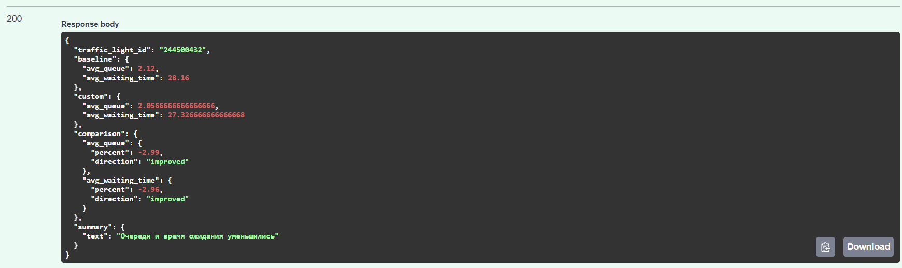

# 🚦 Smart Traffic Simulator for Bishkek

Платформа для тестирования и сравнения настроек светофоров
на основе реальной микроскопической транспортной симуляции (SUMO)
перед внедрением изменений в городе.

## 🏗️ Архитектура

```
┌─────────────────┐          ┌──────────────────┐          ┌─────────────────┐
│                 │          │                  │          │                 │
│  React Frontend │◄────────►│  FastAPI Backend │◄────────►│   SUMO Engine   │
│   (Vite + UI)   │   HTTP   │  (REST API)      │  TraCI   │   (Simulation)  │
│                 │          │                  │          │                 │
└─────────────────┘          └──────────────────┘          └─────────────────┘
```

## API


## Используя наш API, вы тестируете платформы на светофоре (Чуй/Юсупа Абдурахманова)


## ▶ Simulation Playback

Воспроизведение помогает понять *почему* конфигурация работает лучше.

## Получить айди всех светофоров с карты (/traffic-lights)


## Получить фазы светофора по айди

```
Фаза 0: Север-Юг (зеленый) — 41 сек
Фаза 1: Все желтые          —  4 сек
Фаза 2: Восток-Запад (зеленый) — 41 сек
Фаза 3: Все желтые          —  4 сек
```

## Сравнить с текущими фазами светофора свои настройки

------------------------------------------------------



## INFO - Светофор в SUMO


## 🏙 Focus
The project is focused on **Bishkek**, but can be adapted to any city.

## 👥 Team
Otabek - Backend 
Bekmyrza - Simulation
Asel - Frontend / UX
Yana, Sanjar - Pitch / Design
